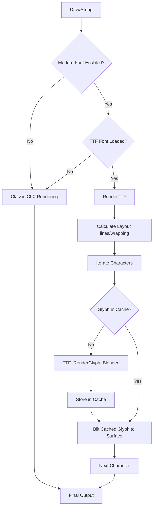

# Development Plan: SDL_ttf Integration and Modernization

This plan outlines the steps required to integrate `SDL_ttf` into DevilutionX and modernize the text rendering system to support high-quality TrueType fonts.

## 1. Current Status
- **Engine:** DevilutionX currently uses a custom 8-bit indexed font system.
- **Assets:** Glyphs are stored in `.clx` sprite sheets (e.g., `assets/fonts/12-00.clx`).
- **Rendering:** Text is rendered by blitting 8-bit sprites and applying color translation tables (`.trn`).
- **SDL_ttf:** The library is not currently integrated into the build system or used in the engine.

## 2. Objectives
- Integrate `SDL_ttf` (SDL2_ttf or SDL3_ttf) as a project dependency.
- Implement a modern text rendering path that supports TrueType fonts.
- Support high-quality anti-aliased text when upscaling is enabled (32-bit rendering).
- **Performance:** Implement glyph caching to ensure high performance in the game loop.
- **Compatibility:** Maintain backward compatibility with the classic 8-bit indexed rendering.
- **Exclusion:** Explicitly disable this feature for SDL1 builds.

## 3. Implementation Steps

### Phase 1: Build System & Dependencies
1.  **Update `vcpkg.json`**: Add `sdl2-ttf` (and `sdl3-ttf` for SDL3 configurations).
2.  **Update `CMake/Dependencies.cmake`**: Add logic to find and configure `SDL_ttf` (similar to `SDL_image`).
3.  **Update `Source/CMakeLists.txt`**: Link `libdevilutionx_text_render` with the `SDL_ttf` library.

### Phase 2: Core Infrastructure
1.  **Smart Pointers**: Add `TTFFontUniquePtr` to `Source/utils/sdl_ptrs.h` using `TTF_CloseFont`.
2.  **Font Management**: Create `Source/engine/render/ttf_font.hpp` and `Source/engine/render/ttf_font.cpp`.
    - Encapsulate `TTF_Init()` and `TTF_Quit()`.
    - Implement `LoadFont(size)` returning `TTFFontUniquePtr`.
3.  **Glyph Caching**: Implement a `GlyphCache` (e.g., `std::unordered_map<char32_t, SDLSurfaceUniquePtr>`) to store rendered glyphs.
    - **Why:** Rendering text to a new surface every frame via `TTF_RenderUTF8_Blended` is too slow. We must cache individual glyphs and blit them.

### Phase 3: Rendering Integration
1.  **Options**: Add `modernFonts` boolean to `GraphicsOptions` in `Source/options.h` (wrapped in `#ifndef USE_SDL1`).
2.  **Update `text_render.cpp`**:
    - Implement `RenderTTF` function that handles layout (wrapping, alignment) using `TTF_SizeUTF8` and blits cached glyphs.
    - Update `DrawString` to dispatch to `RenderTTF` if `modernFonts` is enabled.
3.  **Upscaling Support**:
    - When `GetOptions().Graphics.upscale` is true, load fonts at a higher point size (e.g., 2x or 4x) and render them to the high-res buffer or scale down for crisp anti-aliasing.
    - **Note:** SDF (Signed Distance Field) is deprioritized for Phase 1 due to complexity in the software renderer. High-DPI blended rendering will be used instead.

### Phase 4: UI & Polish
1.  **Settings**: Add a toggle for "Modern Fonts" in the Graphics settings menu.
2.  **Font Bundling**: Bundle a high-quality open-source font (e.g., Charis SIL, Noto Sans) in `assets/`.
3.  **Color Mapping**: Map existing `text_color` enums (Gold, Red, etc.) to `SDL_Color` for TTF rendering.

## 4. Architecture Diagram

## 5. Modernization Benefits
- **Readability**: High-resolution anti-aliased text is significantly easier to read on modern displays.
- **Localization**: Easier support for complex scripts (CJK, etc.) without needing massive sprite sheets.
- **Scalability**: Vector fonts ensure text remains crisp at any resolution.
